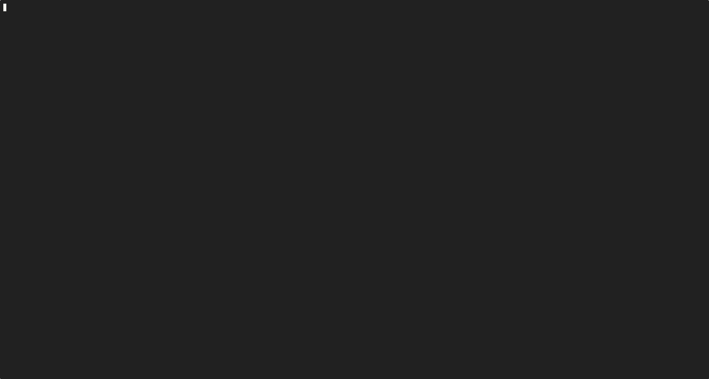

# Agentgateway Demo Framework

A modular framework for demonstrating and testing [agentgateway](https://agentgateway.dev) features.



## Prerequisites

Ensure you have the following installed:

- **Node.js** >= 24.14.0
- **[bun](https://bun.sh)** - JavaScript runtime and package manager
- **Docker Desktop** - for building and pushing images
- **kubectl** - Kubernetes CLI
- **helm** - Kubernetes package manager
- **jq** - JSON processor

Set the following environment variables:

```bash
export ENTERPRISE_AGW_LICENSE_KEY=your-enterprise-agentgateway-license-key
```

Set the following environment variables depending on which LLM providers you intend to use:

```bash
# OpenAI
export OPENAI_API_KEY=

# AWS Bedrock
export AWS_ACCESS_KEY_ID=
export AWS_SECRET_ACCESS_KEY=

# Google Vertex AI
export GOOGLE_APPLICATION_CREDENTIALS=
export GCP_PROJECT=
export GCP_LOCATION=
```

## Installation

### 1. Install Node Dependencies

```bash
bun install
bun link
```

This installs dependencies and creates a global `agw` command.

### 2. Check Dependencies

```bash
# Verify all required tools are installed
node src/cli.js check-deps
```

### 3. Install base infrastructure

If you do not want to install [lok8s](https://github.com/day0ops/lok8s) as your local Kubernetes cluster, you can skip this step.
Otherwise, run the following command after installing [lok8s](https://github.com/day0ops/lok8s) as the base infrastructure:

```bash
make install-infra
```

### 4. Install agentgateway

Run the following command to install agentgateway:

```bash
make install-gateway
```

Pick your [preferred profile](#supported-profiles) and follow the prompts to install the framework.

### 5. Install use cases

Run the following command to install use cases:

```bash
make deploy-usecase
```

Pick your preferred use case and follow the prompts to install the framework.
For e.g. a use case to demo OpenAI provider routing can be deployed:


## Supported Profiles

| Profile                           | Description                                                           |
| --------------------------------- | --------------------------------------------------------------------- |
| `agentgateway-standard`           | Standard installation                                                 |
| `agentgateway-with-observability` | Full observability stack (Solo UI, Prometheus, Grafana, Loki, Tempo)  |
| `agentgateway-with-solo-ui`       | Observability with Solo UI stack                                      |
| `agentgateway-with-keycloak`      | Includes Keycloak integration with the full observability stack       |
| `eks-agentgateway-with-keycloak`  | Keycloak and observability for EKS (gp3, worker nodes, LoadBalancers) |
| `agentgateway-custom-config`      | Custom configuration                                                  |
| `agentgateway-custom-version`     | Custom version, OCI registry, and controller extraEnv                 |

## Workshop Generation

Generate a self-contained workshop runbook (Markdown) from this repo's profiles, addons, providers, and use cases.

```bash
agw workshop generate
```

The command runs an interactive prompt to configure:

- **Title** — workshop document heading
- **Addons** — optional components to install (telemetry, cert-manager, keycloak, solo-ui)
- **Providers** — LLM backends to demo (openai, bedrock, vertex, etc.)
- **Labs** — use-case or feature labs to include after the providers lab
- **Profile** — pin component versions and configuration (optional)
- **Environment** — deployment environment overrides (optional)

Output is written to `./workshop.md` by default. Use `-o` to change the path:

```bash
agw workshop generate -o docs/my-workshop.md
```

Pass `-t` to set the title without a prompt:

```bash
agw workshop generate -t "Agentgateway Hands-on Lab"
```

### Workshop Structure

The generated document follows this structure:

| Section | Content |
|---------|---------|
| `## Environment Variables` | Credential table + consolidated `export` block |
| `## Prerequisites` | Required tools (kubectl, helm, jq, etc.) |
| `## Component Versions` | Version table sourced from the selected profile |
| `## Lab 0: Installation` | agentgateway + Gateway API CRDs + addon installs |
| `## Lab 1: Providers` | Provider-specific manifests (one per selected provider) |
| `## Lab N: <use-case>` | Use-case or feature lab content |
| `## Cleanup` | Teardown commands |

### Portability

The workshop generation code is portable. Copy `src/lib/workshop.js`, `src/lib/workshop-adapters/`, and the per-addon `addons/<name>/workshop.js` sidecars into any repo that follows the same directory layout:

```
config/profiles/    — YAML profile files
config/environments/ — YAML environment files
config/usecases/    — YAML use-case definitions
addons/<name>/workshop.js  — addon sidecar (envVarsFor, envExportsFor, generate)
features/index.js   — optional feature registry
```

`WorkshopBuilder` defaults `projectRoot` to `process.cwd()`, so no configuration change is needed when running from the target repo's root.

---

## Commands

### Setup

| Command                    | Description                                                                      |
| -------------------------- | -------------------------------------------------------------------------------- |
| `make install`             | Install everything (minimal profile)                                             |
| `make install-interactive` | Install everything (interactive profile selection)                               |
| `make install-infra`       | Install local Kubernetes cluster using [lok8s](https://github.com/day0ops/lok8s) |
| `make install-gateway`     | Install agentgateway                                                             |
| `make start`               | Start lok8s cluster                                                              |
| `make stop`                | Stop lok8s cluster                                                               |
| `make status`              | Show infrastructure status                                                       |

### Use Cases

| Command                                               | Description                          |
| ----------------------------------------------------- | ------------------------------------ |
| `make list-usecases`                                  | List available use cases             |
| `make deploy-usecase`                                 | Deploy a use case (interactive)      |
| `make deploy-usecase USECASE=routing/openai-provider` | Deploy a specific use case           |
| `make dryrun-usecase USECASE=routing/openai-provider` | Show generated YAML without applying |
| `make test-usecase USECASE=routing/openai-provider`   | Run tests for a use case             |
| `make clean-usecases`                                 | Clean up all deployed use cases      |

### Profiles & Features

| Command              | Description                          |
| -------------------- | ------------------------------------ |
| `make list-profiles` | List available installation profiles |
| `make list-features` | List available features              |

### Development

| Command       | Description |
| ------------- | ----------- |
| `make test`   | Run tests   |
| `make lint`   | Lint code   |
| `make format` | Format code |

### Cleanup

| Command                  | Description                             |
| ------------------------ | --------------------------------------- |
| `make clean`             | Clean up use cases, gateway, and addons |
| `make clean-usecases`    | Clean up deployed use cases             |
| `make clean-addons`      | Clean up profile-based addons           |
| `make clean-local-infra` | Remove local Kubernetes cluster         |

`agw base clean` also accepts `-a` / `--addons` to include addon cleanup in a single command.

### Extras

| Command                           | Description                        |
| --------------------------------- | ---------------------------------- |
| `make build-extras`               | Build all extra images             |
| `make push-extras`                | Push all extra images (multi-arch) |
| `make deploy-stock-server-mcp`    | Deploy stock MCP server to K8s     |
| `make deploy-currency-server-mcp` | Deploy currency MCP server to K8s  |
| `make deploy-random-server-mcp`   | Deploy random MCP server to K8s    |
| `make deploy-guardrail-webhook`   | Deploy guardrail webhook to K8s    |
| `make deploy-stock-agent`         | Deploy stock agent to K8s          |
| `make deploy-caller-agent`        | Deploy caller agent to K8s         |
| `make deploy-budget-management`   | Deploy budget management to K8s    |
