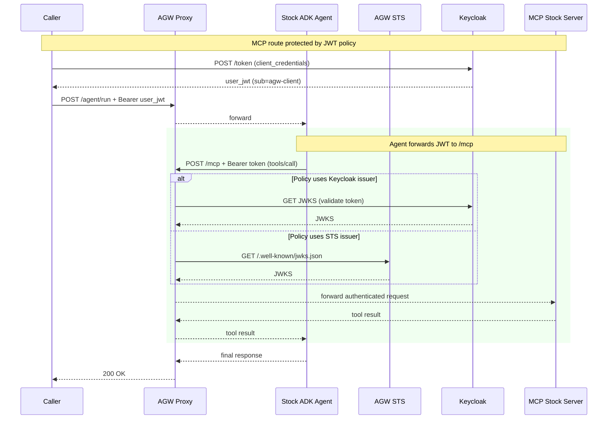

# M2M Workload Identity — Use Case

Demonstrates machine-to-machine (M2M) authentication in an agentic system. The caller obtains a Keycloak JWT; the stock ADK agent propagates that JWT to the protected MCP route. The gateway validates the token against Keycloak's JWKS. No long-lived credentials are stored in the agent.

## Sequence Diagram




## What This Demonstrates

### Impersonation vs Delegation

This use case illustrates **delegation**: the agent forwards the caller's Keycloak JWT to the MCP route; the gateway validates it against Keycloak's JWKS. The MCP server sees the same caller identity — the agent is transparent.

For simple tool-agent scenarios this is appropriate. The caller authorized the request; the agent is just a smart intermediary. See [Christian Posta's blog](https://blog.christianposta.com/agent-identity-impersonation-or-delegation/) for a detailed discussion of when to use impersonation vs delegation.

**Key property:** the agent stores **no long-lived credentials**. Its only runtime dependency is:

- The incoming caller JWT (Authorization header)
- Its auto-mounted K8s ServiceAccount token (available in every pod by default)

### Token flow

The caller obtains a Keycloak JWT (e.g. client_credentials). The agent receives it on `/agent/run` and propagates it to `/mcp`. The MCP route's JWT policy validates that token against Keycloak's JWKS.

## Architecture

The agent is the stock ADK agent (`extras/stock-agent/`) using `ADKTokenPropagationPlugin`: it forwards the caller's JWT from the incoming `Authorization` header into every outbound MCP tool call. The gateway's JWT policy on `/mcp` validates the same token; no in-agent STS exchange.

## Steps

| #   | Feature              | What it creates                                                                           |
| --- | -------------------- | ----------------------------------------------------------------------------------------- |
| 1   | `providers`          | LLM provider at `/openai` (agent calls this for OpenAI model)                             |
| 2   | `mcp-server`         | MCP stock server Deployment + Service + AgentgatewayBackend + HTTPRoute at `/mcp`         |
| 3   | `token-exchange`     | Optional. Enables AGW STS (port 7777); this flow uses Keycloak JWKS on /mcp.              |
| 4   | `obo-token-exchange` | `EnterpriseAgentgatewayPolicy` — JWT auth on `/mcp` route (Keycloak issuer/JWKS)          |
| 5   | `agent`              | ServiceAccount + Deployment + Service + HTTPRoute at `/agent` (image: stock-agent:latest) |

## Running

```bash
# Build the agent image first
cd extras/stock-agent && make build

# Deploy the use case
make deploy-usecase USECASE=agent-to-mcp-authentication

# Test it
make test-usecase USECASE=agent-to-mcp-authentication
```

## Configuration

Use the generic `agent` feature with the stock agent image. Example:

```yaml
- name: agent
  config:
    image: stock-agent:latest
    agentName: stock-agent
    model: gpt-4o-mini
    llmBaseUrl: http://agentgateway.agentgateway-system.svc.cluster.local:8080/openai
    mcpUrl: http://agentgateway.agentgateway-system.svc.cluster.local:8080/mcp
    pathPrefix: /agent
    pathRewrite: /
    routeName: stock-agent
```
