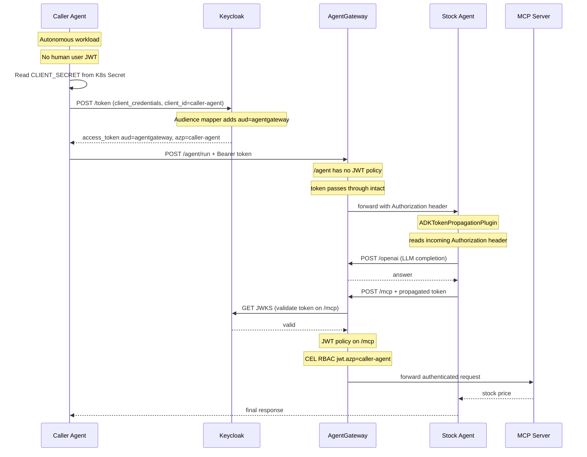

# Agent Workload Identity — Client Credentials (Token Propagation)

Demonstrates agent-to-agent authentication using Keycloak `client_credentials` grant. An autonomous **caller agent** authenticates with a stored `client_id` + `client_secret` (Kubernetes Secret) to obtain a token scoped for AgentGateway — no human user is involved.

**Key characteristic:** The caller's token **propagates end-to-end** through the stock agent to MCP via `ADKTokenPropagationPlugin`. The `/agent` route has **no JWT policy** — the token passes through untouched. Enforcement happens only at the `/mcp` route.

> **Compare with [workload-identity-chain](workload-identity-chain.md):** That use case uses SA token exchange (no long-lived secrets) and enforces JWT policies at **both** hops — each agent authenticates independently with its own identity.

## Sequence Diagram



## Token Claims

The Keycloak access token contains:

```json
{
  "iss": "http://keycloak.keycloak.svc.cluster.local:8080/realms/agw-dev",
  "sub": "a3f1b2c4-...",
  "azp": "caller-agent",
  "aud": ["agentgateway"],
  "exp": 1234567890,
  "iat": 1234567000,
  "typ": "Bearer"
}
```

| Claim | Value | Notes |
|-------|-------|-------|
| `iss` | Keycloak realm URL | Used by AGW to fetch JWKS for signature validation |
| `sub` | Opaque UUID | Keycloak's internal ID for the service account user — stable but not human-readable |
| `azp` | `caller-agent` | **The workload identity claim.** Equals the `client_id`. Human-readable and predictable. |
| `aud` | `["agentgateway"]` | Added by the hardcoded audience mapper on the Keycloak client. AGW policy requires this. |

### Why `azp` and not `sub`?

Unlike Microsoft Entra (where `sub` is the service principal's OID, or `appid` is the application ID), Keycloak's `client_credentials` grant sets `sub` to an **opaque UUID** — the internal ID of a synthetic "service account user" created for the client. This UUID is stable and consistent, but it is not the `client_id` string.

`azp` (authorized party, RFC 7519) contains the `client_id` of the client that requested the token. For workload identity, `azp` is the correct claim for policy checks:

| IdP | Workload identifier claim |
|-----|--------------------------|
| Keycloak | `azp` = client_id (e.g. `caller-agent`) |
| Entra | `appid` = application (client) ID |
| GCP | `email` in the service account token |
| AWS | `client_id` in the STS token |

## What This Demonstrates

### Token Flows End-to-End

The `/agent` route has **no JWT policy** — the caller's token passes through intact to the stock agent. `ADKTokenPropagationPlugin` reads the `Authorization` header from the incoming request and injects it into every outbound MCP call. The JWT policy sits on the `/mcp` route, which is the actual enforcement boundary for the tool backend.

This pattern means the MCP server's access control is scoped to the actual caller's workload identity (`azp=caller-agent`), not to the stock agent acting as an intermediary.

### Two-Layer Access Control

The MCP backend enforces two independent checks:

1. **JWT authentication on `/mcp` HTTPRoute** — validates the token signature, expiry, and `aud=agentgateway`. Unauthenticated requests receive 401.
2. **CEL RBAC on `mcp-backend` AgentgatewayBackend** — validates that the workload (`jwt.azp`) is authorized to call the specific tool (`mcp.tool.name`). Unauthorized tool calls receive a structured error.

```yaml
# EnterpriseAgentgatewayPolicy — tool-level RBAC
matchExpressions:
  - 'jwt.azp == "caller-agent" && mcp.tool.name == "get_stock_price"'
```

This allows future policies like: "batch-agent can call all tools, but caller-agent can only call get_stock_price."

### Autonomous vs Delegated Identity

The existing [agent-to-mcp-authentication](agent-to-mcp-authentication.md) use case demonstrates **delegation**: the stock agent forwards a *human user's* JWT to the MCP route.

This use case demonstrates **autonomous workload identity**: the caller agent *generates its own token* and authenticates as itself, not on behalf of any user. This is the correct pattern for:

- Scheduled/batch agents that run without user interaction
- Agent pipelines where one agent calls another as a backend service
- Microservice-to-microservice calls inside an agentic system

### AGW as the Enforcement Point

The AgentGateway enforces on the `/mcp` route:
1. Token signature is valid (Keycloak JWKS)
2. Token is not expired
3. `aud` contains `agentgateway` — the token was explicitly requested for this gateway
4. CEL RBAC: `jwt.azp == "caller-agent" && mcp.tool.name == "get_stock_price"` — only this workload may call this specific tool

The stock agent itself requires no auth logic. It simply propagates the incoming `Authorization` header via `ADKTokenPropagationPlugin` — gateway policy handles all enforcement.

## Architecture: Steps and Resources

| Step | Feature | Resources Created |
|------|---------|-------------------|
| 1 | `providers` | HTTPRoute `/openai`, provider config |
| 2 | `mcp-server` | Deployment `stock-server-mcp`, AgentgatewayBackend `mcp-backend`, HTTPRoute `/mcp` |
| 3 | `workload-identity` | Keycloak client `caller-agent` + audience mapper, K8s Secret `caller-agent-credentials` |
| 4 | `obo-token-exchange` | `EnterpriseAgentgatewayPolicy` — JWT auth (aud=agentgateway) on HTTPRoute `mcp` |
| 5 | `mcp-tool-access` | `EnterpriseAgentgatewayPolicy` — CEL RBAC on AgentgatewayBackend `mcp-backend` |
| 6 | `agent` | Deployment `stock-agent`, Service, ServiceAccount, HTTPRoute `/agent` |
| 7 | `workload-agent` | Deployment `caller-agent`, Service, ServiceAccount, HTTPRoute `/caller-agent` |

## Running

```bash
# Build both agent images
cd extras/stock-agent && make build
cd extras/caller-agent && make build

# Deploy the use case
node src/cli.js usecase deploy agent-workload-identity

# Test it — the caller agent self-authenticates and calls the stock agent
curl -X POST http://<gateway-ip>:8080/caller-agent/run \
  -H 'Content-Type: application/json' \
  -d '{"query": "What is the current stock price of AAPL?"}'

# Verify direct access to stock-agent works (no JWT policy on /agent)
# but a direct call to /mcp without a token is blocked
curl -X POST http://<gateway-ip>:8080/mcp \
  -H 'Content-Type: application/json' \
  -d '{"jsonrpc":"2.0","method":"tools/list","id":1}'
  # → 401 Unauthorized
```

## What about refresh ?

Current Token Handling

The WorkloadTokenProvider in extras/caller-agent/server/caller_agent/auth.py already implements automatic token refresh:

```
# Line 53-58: Refreshes token 30 seconds before expiry
async def get_token(self) -> str:
    async with self._lock:
        if self._token and time.monotonic() < self._expires_at - 30:
            return self._token
        self._token, self._expires_at = await self._fetch()
```

However, it refreshes by re-authenticating with client_credentials or token exchange, not using OAuth2 refresh_token grant.

Can OAuth2 Refresh Token Be Implemented?

Yes, but it may not be the best approach for this use case:

┌───────────────────┬───────────────────────────┬──────────────────────────────────────────────────────┐
│     Approach      │ Current (re-authenticate) │                 OAuth2 refresh_token                 │
├───────────────────┼───────────────────────────┼──────────────────────────────────────────────────────┤
│ Complexity        │ Simple                    │ Requires storing refresh_token                       │
├───────────────────┼───────────────────────────┼──────────────────────────────────────────────────────┤
│ Network calls     │ 1 call to token endpoint  │ 1 call (refresh) or 2 (refresh + re-auth if expired) │
├───────────────────┼───────────────────────────┼──────────────────────────────────────────────────────┤
│ Keycloak config   │ None                      │ Must enable "refresh token" on client                │
├───────────────────┼───────────────────────────┼──────────────────────────────────────────────────────┤
│ M2M best practice │ ✅ Recommended            │ Not typical for machine-to-machine                   │
└───────────────────┴───────────────────────────┴──────────────────────────────────────────────────────┘

Why re-authentication is preferred for workload identity:
- client_credentials grants are stateless — no session to maintain
- Refresh tokens are designed for long-lived user sessions, not M2M
- Re-authentication is simpler and equally secure for workloads

If You Still Want Refresh Token Support

It would require:

1. Keycloak config: Enable refresh tokens on the caller-agent client
2. Code changes in auth.py:
  - Store refresh_token from response
  - Try grant_type=refresh_token first
  - Fall back to client_credentials if refresh fails

Would you like me to implement this, or is the current expiry-aware caching sufficient for your demo?