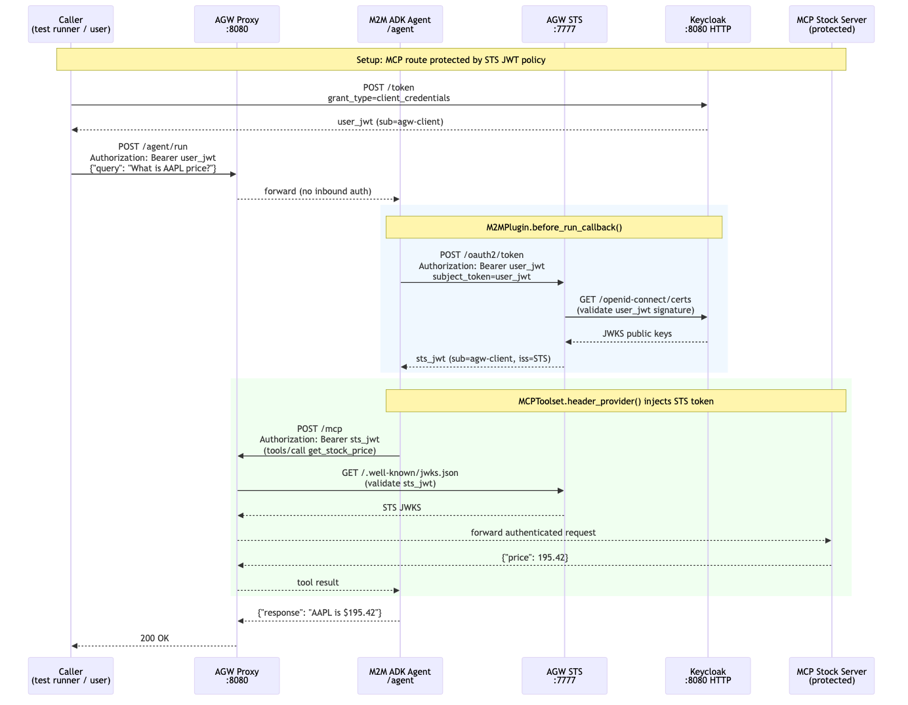
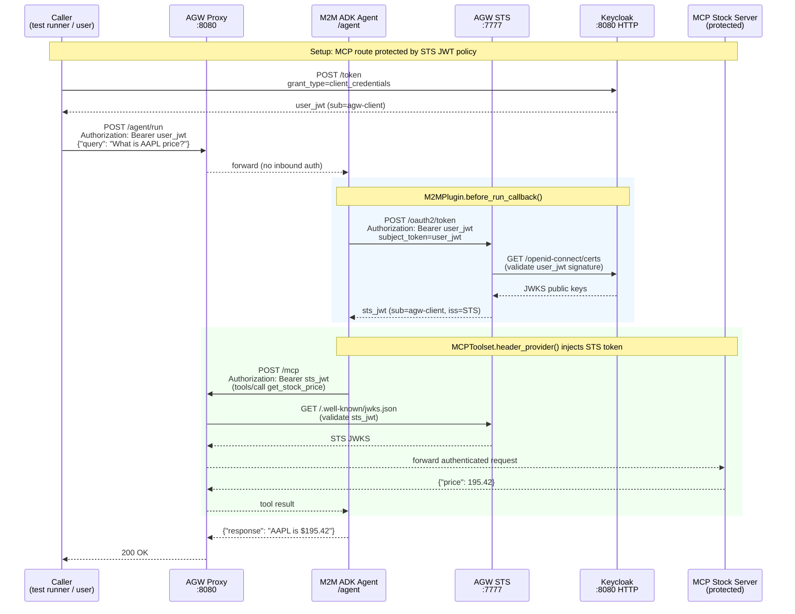

# M2M Workload Identity — Use Case

Demonstrates machine-to-machine (M2M) authentication in an agentic system using the AGW Security Token Service (STS). A real ADK agent exchanges the caller's JWT with the STS before calling a protected MCP tool server — with no long-lived credentials stored in the agent itself.

## Sequence Diagram





## What This Demonstrates

### Impersonation vs Delegation

This use case illustrates the **impersonation** pattern: the STS issues a token with the same `sub` as the caller's JWT (`sub=agw-client`). The MCP server sees the caller's identity — the agent is transparent.

For simple tool-agent scenarios this is appropriate. The caller authorized the request; the agent is just a smart intermediary. See [Christian Posta's blog](https://blog.christianposta.com/agent-identity-impersonation-or-delegation/) for a detailed discussion of when to use impersonation vs delegation.

**Key property:** the agent stores **no long-lived credentials**. Its only runtime dependency is:
- The incoming caller JWT (Authorization header)
- Its auto-mounted K8s ServiceAccount token (available in every pod by default)

### The Token Exchange Chain

| Token | Issuer | Audience | Used for |
|-------|--------|----------|---------|
| `user_jwt` | Keycloak | `account` | Authenticating the caller to the STS |
| `sts_jwt` | AGW STS (`:7777`) | `agw-client` | Calling the protected MCP route |

The MCP server's JWT policy validates `sts_jwt` against the STS JWKS. Keycloak is **not trusted directly** by the MCP server — all validation flows through the STS.

## Architecture

```
extras/m2m-agent/
  server/
    m2m_agent/
      plugin.py    # M2MPlugin — STS exchange + header injection
      agent.py     # ADK LlmAgent wired to MCPToolset + M2MPlugin
      server.py    # FastAPI: extracts Authorization header → session state
  config/          # K8s ServiceAccount, Deployment, Service YAMLs
  Makefile         # make build / deploy / undeploy
```

### M2MPlugin

The custom `M2MPlugin` fills a gap in `agentsts-adk`: the AGW STS `/oauth2/token` endpoint requires `Authorization: Bearer <token>` on the exchange request itself. The built-in `ADKTokenPropagationPlugin` does not send this header. `M2MPlugin` handles the full exchange:

1. `before_run_callback`: reads the user JWT from `session.state["headers"]`, POSTs to the STS with the Authorization header, caches the resulting STS token by session ID.
2. `header_provider`: called by `MCPToolset` before each tool request; returns `{"Authorization": "Bearer <sts_token>"}`.
3. `after_run_callback`: clears the cache entry for the session.

### FastAPI Server

`server.py` extracts the incoming HTTP `Authorization` header and stores it in the ADK session state under the key `"headers"`. The `M2MPlugin.before_run_callback` reads from this key, which is the same contract as `agentsts-adk`'s `ADKTokenPropagationPlugin`.

## Steps

| # | Feature | What it creates |
|---|---------|----------------|
| 1 | `mcp-server` | MCP stock server Deployment + Service + AgentgatewayBackend + HTTPRoute at `/mcp` |
| 2 | `token-exchange` | Helm upgrade enabling the AGW STS (port 7777) with Keycloak HTTP JWKS validation |
| 3 | `obo-token-exchange` | `EnterpriseAgentgatewayPolicy` — JWT auth on `/mcp` route, STS as issuer/JWKS |
| 4 | `m2m-agent` | Secret (API keys) + ServiceAccount + Deployment + Service + HTTPRoute at `/agent` |

## Running

```bash
# Build the agent image first
cd extras/m2m-agent
make build

# Deploy the use case
make deploy-usecase USECASE=m2m-workload-identity

# Test it
make test-usecase USECASE=m2m-workload-identity
```

## Configuration

The `m2m-agent` feature reads `GOOGLE_API_KEY` or `OPENAI_API_KEY` from the environment. Set one before deploying:

```bash
export GOOGLE_API_KEY=<your-key>
# or
export OPENAI_API_KEY=<your-key>
```

To use a different model, pass `model` in the feature config:

```yaml
- name: m2m-agent
  config:
    model: gpt-4o-mini   # or gemini-2.0-flash (default)
```
