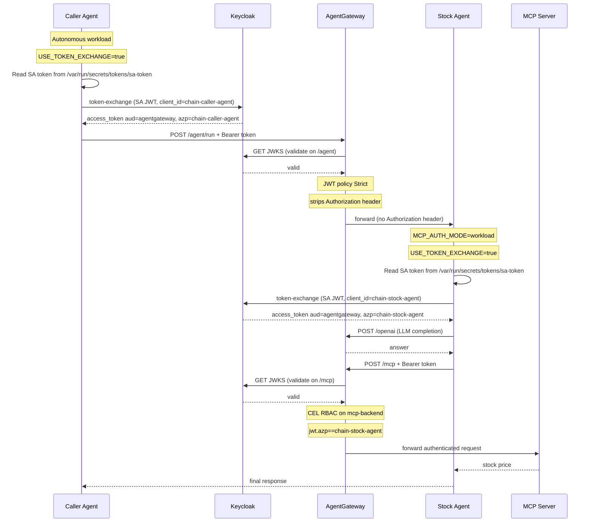

# Workload Identity Chain — SA Token Exchange (Independent Authentication)

Demonstrates a two-hop workload identity chain where every agent authenticates **as itself** at each gateway boundary using Kubernetes ServiceAccount token exchange. Each workload exchanges its auto-mounted SA JWT for a Keycloak access token — **no long-lived secrets**, no token delegation or propagation.

> **Compare with [agent-workload-identity](agent-workload-identity.md):** That use case uses `client_credentials` with stored secrets and propagates a **single token** end-to-end via `ADKTokenPropagationPlugin`. JWT policy is only on `/mcp`. Here, each agent gets its **own token** independently, and JWT policies enforce at **both** `/agent` and `/mcp` routes.

| Hop | Caller                           | Identity                 | Enforcement                                                |
| --- | -------------------------------- | ------------------------ | ---------------------------------------------------------- |
| 1   | Caller Agent → AGW → Stock Agent | `azp=chain-caller-agent` | JWT policy on `/agent` HTTPRoute                           |
| 2   | Stock Agent → AGW → MCP          | `azp=chain-stock-agent`  | JWT policy on `/mcp` HTTPRoute + CEL RBAC on `mcp-backend` |

## Sequence Diagram



## Token Claims at Each Hop

### Hop 1 — Caller Agent to Stock Agent

```json
{
  "iss": "http://keycloak.keycloak.svc.cluster.local:8080/realms/agw-dev",
  "sub": "<opaque-uuid-for-chain-caller-agent>",
  "azp": "chain-caller-agent",
  "aud": ["agentgateway"],
  "exp": 1234567890
}
```

### Hop 2 — Stock Agent to MCP

```json
{
  "iss": "http://keycloak.keycloak.svc.cluster.local:8080/realms/agw-dev",
  "sub": "<opaque-uuid-for-chain-stock-agent>",
  "azp": "chain-stock-agent",
  "aud": ["agentgateway"],
  "exp": 1234567890
}
```

The MCP server and its CEL policy see only the chain-stock-agent identity. The chain-caller-agent is invisible at the MCP boundary — the two security domains are fully isolated.

## Comparison: Chain vs End-to-End Propagation

|                                          | `agent-workload-identity`       | `workload-identity-chain`                                                  |
| ---------------------------------------- | ------------------------------- | -------------------------------------------------------------------------- |
| `/agent` JWT policy                      | None — token passes through     | Strict — `azp=chain-caller-agent`                                          |
| `/mcp` JWT policy                        | Strict — `azp=caller-agent`     | Strict — `azp=chain-stock-agent`                                           |
| MCP tool RBAC                            | `jwt.azp == "caller-agent"`     | `jwt.azp == "chain-stock-agent"`                                           |
| Identity visible at MCP                  | `caller-agent`                  | `chain-stock-agent` only                                                   |
| Stock agent code change                  | None                            | `MCP_AUTH_MODE=workload`                                                   |
| Credential type                          | Client credentials (K8s Secret) | SA token exchange — no long-lived secrets                                  |
| Keycloak clients                         | `caller-agent`                  | `chain-caller-agent` + `chain-stock-agent` (isolated from other use cases) |
| Blast radius if caller-agent compromised | Attacker can call MCP directly  | Attacker cannot reach MCP (no chain-stock-agent credentials)               |

## Why Two-Hop Identity?

### Blast Radius Isolation

In `agent-workload-identity`, the caller's token flows all the way to MCP. If the caller-agent's credentials are compromised, the attacker has a token that can call MCP tools directly — bypassing the stock agent entirely.

In this use case, the chain-caller-agent's token is only valid for the `/agent` route. It has no power over the `/mcp` route. A compromised chain-caller-agent cannot impersonate chain-stock-agent to MCP.

### Independent Auditability

Each hop produces its own audit trail with a distinct identity:

- AGW logs for `/agent` show `azp=chain-caller-agent`
- AGW logs for `/mcp` show `azp=chain-stock-agent`

This makes it possible to answer "which agent called MCP and how many times?" independently from "which agent called the stock agent?"

### Separation of Concerns

The stock agent's MCP authorization policy (`jwt.azp == "chain-stock-agent"`) is completely decoupled from who called the stock agent. You can add new callers (batch-agent, scheduler-agent) without changing the MCP policy — as long as they can reach the stock agent, the stock agent handles MCP authentication.

## Tool-Level Access Control

The CEL RBAC policy on the `mcp-backend` `AgentgatewayBackend` restricts which tools the chain-stock-agent identity may invoke:

```yaml
matchExpressions:
  - 'jwt.azp == "chain-stock-agent" && mcp.tool.name == "get_stock_price"'
```

This is enforced at the backend level, after the `/mcp` JWT policy has already validated the token. Two-layer enforcement:

1. **JWT auth** — is the token valid and issued for this gateway? (`aud=agentgateway`)
2. **CEL RBAC** — is this workload authorized to call this specific tool? (`azp=chain-stock-agent && tool=get_stock_price`)

Future policies can differentiate tool access by workload identity:

```yaml
matchExpressions:
  - 'jwt.azp == "chain-stock-agent" && mcp.tool.name == "get_stock_price"'
  - 'jwt.azp == "admin-agent"' # admin-agent can call all tools
```

## Architecture: Steps and Resources

| Step | Feature                  | Resources Created                                                                                                          |
| ---- | ------------------------ | -------------------------------------------------------------------------------------------------------------------------- |
| 1    | `providers`              | HTTPRoute `/openai`, provider config                                                                                       |
| 2    | `mcp-server`             | Deployment `stock-server-mcp`, AgentgatewayBackend `mcp-backend`, HTTPRoute `/mcp`                                         |
| 3    | Keycloak addon (profile) | Keycloak client `chain-caller-agent` + audience mapper + K8s Secret `chain-caller-agent-credentials`                       |
| 4    | Keycloak addon (profile) | Keycloak client `chain-stock-agent` + audience mapper + K8s Secret `chain-stock-agent-credentials`                         |
| 5    | `obo-token-exchange`     | `EnterpriseAgentgatewayPolicy` `chain-stock-agent-jwt-policy` on HTTPRoute `stock-agent`                                   |
| 6    | `obo-token-exchange`     | `EnterpriseAgentgatewayPolicy` `chain-mcp-jwt-policy` on HTTPRoute `mcp`                                                   |
| 7    | `mcp-tool-access`        | `EnterpriseAgentgatewayPolicy` `chain-mcp-tool-access` on AgentgatewayBackend `mcp-backend`                                |
| 8    | `workload-agent`         | Deployment `stock-agent` (`MCP_AUTH_MODE=workload`, `useTokenExchange: true`), Service, ServiceAccount, HTTPRoute `/agent` |
| 9    | `workload-agent`         | Deployment `caller-agent` (`useTokenExchange: true`), Service, ServiceAccount, HTTPRoute `/caller-agent`                   |

## Running

```bash
# Build both agent images
cd extras/stock-agent && make build
cd extras/caller-agent && make build

# Deploy the use case
node src/cli.js usecase deploy workload-identity-chain

# Test it — both hops are independently authenticated
curl -X POST http://<gateway-ip>:8080/caller-agent/run \
  -H 'Content-Type: application/json' \
  -d '{"query": "What is the current stock price of AAPL?"}'

# Verify the first hop is enforced — direct call without a token is blocked
curl -X POST http://<gateway-ip>:8080/agent/run \
  -H 'Content-Type: application/json' \
  -d '{"query": "What is the price of AAPL?"}'
  # → 401 Unauthorized

# Verify the second hop is enforced — caller-agent token cannot reach MCP directly
# (caller-agent token has azp=chain-caller-agent, not azp=chain-stock-agent)
```

## `MCP_AUTH_MODE=workload` in the Stock Agent

When deployed in this use case, the stock agent has `MCP_AUTH_MODE=workload` in its environment. This activates `WorkloadMCPTokenProvider` in `extras/stock-agent/server/stock_agent/agent.py`:

```python
if _MCP_AUTH_MODE == "workload":
    from .workload_auth import WorkloadMCPTokenProvider as _WorkloadMCPTokenProvider
    _mcp_header_provider = _WorkloadMCPTokenProvider().header_provider
else:
    from agentsts.adk import ADKTokenPropagationPlugin as _ADKTokenPropagationPlugin
    _mcp_header_provider = _ADKTokenPropagationPlugin().header_provider
```

`WorkloadMCPTokenProvider` reads the auto-mounted ServiceAccount JWT at `/var/run/secrets/tokens/sa-token` and exchanges it for a Keycloak access token (`azp=chain-stock-agent`) via RFC 8693 token exchange. The token is cached in-memory and refreshed 30 seconds before expiry. No `CLIENT_SECRET` or K8s Secret is required.
